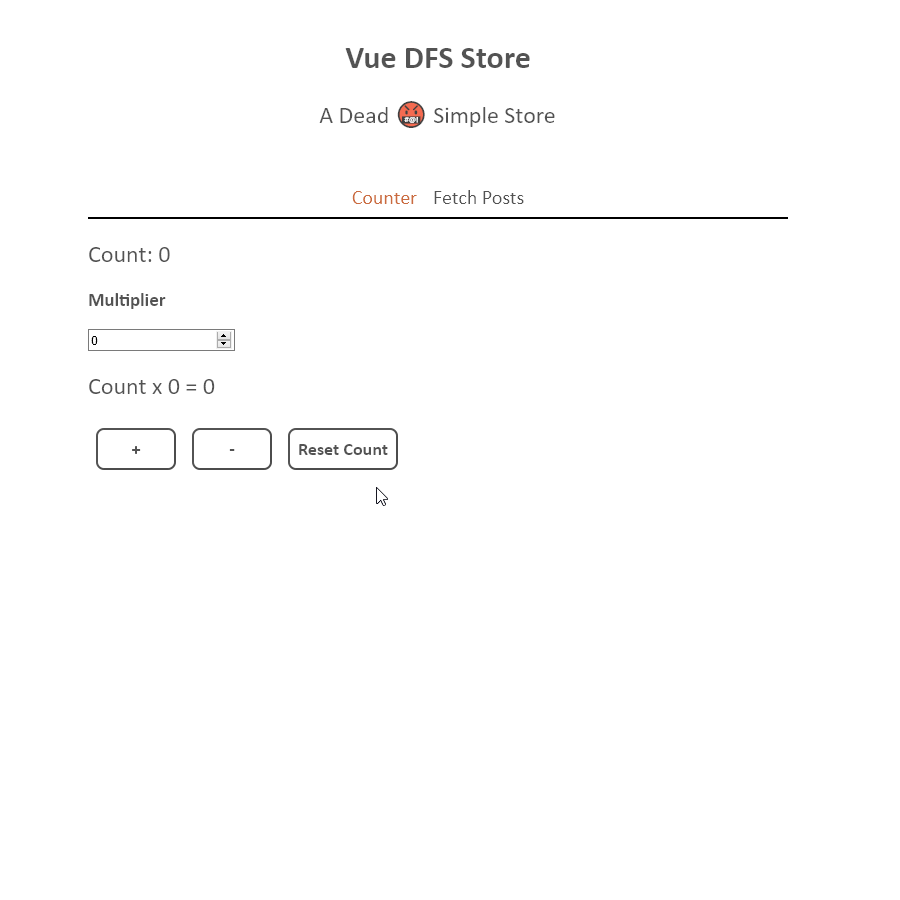

# VUE DFS Store - A Dead 🤬 Simple Store

This Typescript library wraps Vue's reactivity API for simply initializing and accessing a store via functions called *accessors*. These accessors are inspired by [Zustand's](https://github.com/pmndrs/zustand) *actions*, though there are differences since Vue's reactivity system works with mutable state.

The library works as a plugin so that stores can be injected in `app.use()` statements when initializing an application, or via an exported *provider* which can be used inside of a `setup()` method at the application level of your choice! 

*Provide/injecct have not yet been tested with Options API*.

## Provided Demo App



## How to Use

`npm install vue-dfs-store`

You will then have access to the following:

```ts
import { createStore, useStore } from 'vue-dfs-store';
```

### Create Store

Let's show how to use this with... a counter app because nothing under the sun is new. This is the same counter demoed at the top of this readme!

Use the createStore function with the following properties provided in a configuration object.

The configuration recieve a `name`, an `initialState` object, an `accessorsCreator`, and a `mutatorHook`. (So far all required, but this may change).

The `accessorsCreator` receives `mutate` and `get` functions. 

`get` provides access to a Vue *readonly* version of the reactive state. You can see how this is used in the `multCount` accessor below to compute a multiple of the current counter value.

The only access to the store's mutable state is provided by the `mutate` method. This is similar [Zustand's](https://github.com/pmndrs/zustand) `set` method. You can make as many mutations as you want inside of an accessor, and accessors can be async as well.

`mutatorHooks` is used to run some code after each mutation. In the future, I hope to add functionality to create multiple stores which share a common mutatorHook (as well as functionality for executing code both before and after each mutation).

You may provide explicit types for the state and accessors (as shown below) to `createState`, or you may rely on inferred types.

```ts
type CounterState = {
  count: number;
};

type CounterAccessors = {
  incCount: (val: number) => void;
  clearCount: () => void;
  multCount: (val: number) => number;
};

const counterStore = createStore<CounterState, CounterAccessors>({
  name: 'counterStore',
  initialState: {
    count: 0,
  },
  accessorsCreator: (mutate, get) => ({
    incCount: (val: number) => mutate(state => (state.count += val)),
    clearCount: () => mutate(state => (state.count = 0)),
    multCount: (val: number) => get().count * val,
  }),
  mutatorHook: state => console.log(state),
});

export default counterStore;
```

### Created Store Properties

`createStore` returns the following, where U and V generics will be the types of the reactive version of the state, and the accessors created by `accessorsCreator`, respectively.

```ts
export type Store<T, U> = {
  readonly name: string;
  storeAPI: StoreAPI<T, U>;
  install: (app: App) => void; // makes Store implement Plugin from vue
  readonly storeKey: symbol;
  provider: () => void;
};
```

The most important property to you, the end user, is probably `storeAPI`. This is the object that will be returned when a user accesses the store inside of Vue components with the `useStore` function/composable.

```ts
export type StoreAPI<T, U> = {
  readonly state: ToRefs<ReadonlyState<ReactiveState<T>>>;
  accessors: U;
};
```

The `StoreAPI` provides components with readonly state and accessor methods. For those familiar with Vue reactivty, note that the state returns the reactive state with [ref properties (`ToRefs`)](https://composition-api.vuejs.org/api.html#torefs). This is so that the components can pass the individual properties to their Vue templates. 

### Provide Store

Observe that the object returned by `createStore`, has an `install` method and a `provider`. 

You can pass the store directly to `app.use()` as follows to provide the store at the root of your application. 

```ts
import { createApp } from 'vue';
import App from './App.vue';
import counterStore from './store/counter';

createApp(App)
  .use(counterStore)
  .mount('#app');
```

You can also import and execute `provider()` from the store inside of any setup method if you don't want to provide the store at the root. 

### Use Store

Import the `useStore` function and pass it the store we just created to get access to the readonly state and accessors. Look at how we can use an accessor method inside of a `computed` to recalculate the `multCount` method when it's reactive dependency, `multiplier` is updated.

```vue
<script lang="ts">
import { defineComponent, ref, computed } from 'vue';
import { useStore } from 'vue-dfs-store';
import counterStore from '../store/counter'; // or whatever hte path is to your counter

export default defineComponent({
  name: 'Counter',
  setup() {
    const multiplier = ref(0);
    const { state, accessors } = useStore(counterStore);

    // wrap an accessor in computer to create a "getter"
    const multipliedCount = computed(() =>
      accessors.multCount(multiplier.value)
    );

    return {
      count: state.count,
      incCount: accessors.incCount,
      clearCount: accessors.clearCount,
      multiplier,
      multipliedCount,
    };
  },
});
</script>
```

## Running Demo Vue Application

To run the demo application:

1. Clone this here repository
2. `npm install` / `yarn install` in root project directory
3. `npm run dev` / `yarn dev` - This runs the Rollup config and runs a demo Vue app stored in the *examples* folder with the newly compiled library.

Enjoy, my friends!
